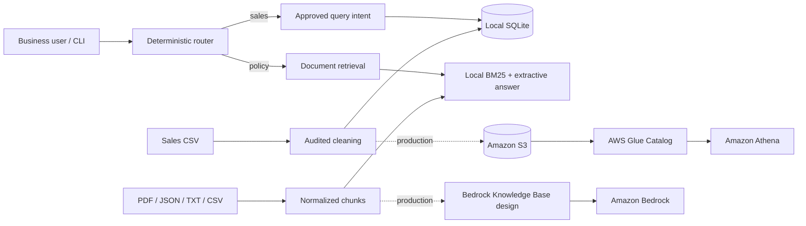

# NorthStar Retail Assistant

## 1. Problem and scope

This time-boxed MVP routes a business user's plain-English question to either a cleaned sales warehouse or supplied product-support/policy documents. The default path is deterministic, runs locally without AWS credentials or an LLM, and gives source-attributed policy answers. It intentionally excludes authentication, a web UI, orchestration frameworks, and other non-core features.

## 2. Chosen AWS architecture

AWS is the production target. Raw and curated data live in Amazon S3; AWS Glue catalogs curated sales; Amazon Athena runs approved analytical SQL; Amazon Bedrock provides optional grounded generation and Knowledge Base retrieval. Least-privilege IAM scopes the application to its bucket, workgroup, catalog, and configured model. Local implementations sit behind narrow service boundaries so they can be replaced without changing routing or question intent logic.

## 3. Architecture diagram



## 4. Repository structure

```text
src/
  config.py, cleaning.py, ingest.py, router.py, app.py
  sales/       # interface, readable SQL, SQLite and Athena adapters
  documents/   # mixed-format loader, BM25 retrieval, local and Bedrock generation
  cloud/       # S3 adapter
tests/         # cleaning, SQL, routing and policy retrieval tests
infra/template.yaml
data/sales.csv
data/product_docs/       # eight supplied source documents, unchanged
artifacts/               # generated DB, index, report; ignored by Git
```

## 5. Local setup

Python 3.11 or newer is required.

```bash
python3.11 -m venv .venv
source .venv/bin/activate
pip install -r requirements.txt
cp .env.example .env  # optional; defaults are already local
```

No cloud account, credentials, model endpoint, or network call is used in `APP_MODE=local`.

## 6. Ingestion

```bash
python -m src.ingest
```

This validates and cleans `data/sales.csv`, recreates `artifacts/northstar.db` with a real indexed `sales` table, dynamically loads the eight policy files, writes `artifacts/document_index.json`, and writes every cleaning count to `artifacts/cleaning_report.json`. Source files are never rewritten. If documents are directly under `data/`, configuration automatically supports that fallback layout.

## 7. Running questions

```bash
python -m src.app --question "What are the top 5 products by total revenue?"
python -m src.app --question "What is total revenue by region?"
python -m src.app --question "What is the best-selling category by revenue in the 7 days immediately before the latest order date in the dataset?"
python -m src.app --question "How long does standard cross-region shipping take?"
```

Sales answers come only from read-only queries against the SQLite table. SQL remains visible in `src/sales/queries.py`. Unknown or cross-domain questions receive a controlled clarification response.

## 8. Testing

```bash
python -m pytest -q
```

Tests cover mixed dates, trimming, exact duplicates, conflicting order IDs, stable SKU imputations, invalid/missing/non-positive quantities, invalid prices/dates, SQLite table creation, all three mandatory SQL questions, router precedence and ambiguity, all four document formats, several retrieval topics, and source attribution.

## 9. Data-quality findings

Profiling the supplied files found:

- 5,132 raw sales rows and 9 columns: `order_id`, `order_date`, `store_id`, `product_id`, `product_name`, `category`, `quantity`, `unit_price`, `region`.
- Dates: 5,097 `YYYY-MM-DD` values and 35 `YYYY/MM/DD` values; no unparseable dates.
- 8 exact duplicate rows; after deduplication, 23 repeated ambiguous order IDs covering 46 rows.
- Missing values: 31 product names, 40 quantities, and 32 unit prices.
- 35 negative quantities, no zero quantities, and no non-positive known prices.
- For every SKU, each available product name, category, and unit price has exactly one distinct value, supporting conservative SKU-based imputations.
- 5,003 rows remain after cleaning. The source date range ends on 2026-08-27.
- Eight documents were found: four 20-page PDFs plus two JSON, one TXT, and one CSV document. Numbered PDF sections and structured records normalize to 826 attributable chunks.

The raw and copied `sales.csv` SHA-256 is `7013fd6d7459296fa58bb0f3abda525d5d43da477035026729d0a51963af6a0f`.

## 10. Cleaning decisions and rationale

Rules are applied in this explicit order and each action is counted:

1. Trim strings and convert empty strings to missing values, avoiding identifier/category mismatches caused by whitespace.
2. Parse only the observed `YYYY-MM-DD` and `YYYY/MM/DD` formats and normalize to ISO dates; invalid dates are excluded rather than guessed.
3. Remove exact duplicates because they add no distinct source information.
4. Exclude every remaining row for a repeated `order_id`; conflicting source records are ambiguous and selecting one would be arbitrary.
5. Fill a missing product name only when that SKU has one unique known name.
6. Fill a missing unit price only when that SKU has one unique known price.
7. Exclude missing or non-numeric quantities because quantity cannot be safely inferred.
8. Exclude quantity `<= 0` from gross-sales analytics because the source is order history and defines no return/cancellation semantics.
9. Require a positive numeric unit price; unresolved or non-positive prices are excluded.
10. Compute `revenue = quantity * unit_price` only after all validation.

No row is silently changed. Actual ingestion counts are persisted in the cleaning report.

## 11. Assumptions

- Currency is intentionally displayed without a symbol because the source supplies none.
- “7 days immediately before” means `[latest_date - 7 days, latest_date)`: seven calendar dates, excluding the latest date itself.
- Gross revenue does not model tax, shipping, discounts, refunds, or cancellations absent from the data.
- A product mapping is stable only when exactly one non-missing value exists for that SKU and attribute.

## 12. Limitations

- The router supports the three required sales intents rather than arbitrary text-to-SQL, reducing injection and hallucination risk.
- Local document answers return the strongest relevant supplied passage; they are grounded but not conversationally rewritten by an LLM.
- The lexical retriever handles direct terminology better than semantic paraphrases.
- Athena/Bedrock/S3 invocation seams are implemented, but AWS deployment, Glue table creation/crawling, Knowledge Base provisioning, pagination hardening, and production monitoring are outside this local MVP.
- No live AWS deployment was performed or claimed.

## 13. Security considerations

- `.env`, local artifacts, caches, and credentials are ignored; no secrets are stored in source.
- Local SQLite is opened in read-only mode for answers, and user text never becomes SQL. Query parameters are used for values.
- S3 blocks public access, enables encryption and versioning. Athena result encryption is configured.
- The CloudFormation role is resource-scoped to the application bucket, Athena workgroup, Glue database/tables, and configured Bedrock model. A production deployment should give its compute identity this role and add audit logging, retention, KMS keys where required, and tenant-aware authorization.

## 14. Prompting approach

Local mode does not prompt an LLM. Routing uses deterministic domain indicators, sales maps only to approved SQL, and policy generation extracts the top retrieved passage with its metadata. The optional Bedrock prompt instructs the model to answer only from supplied passages, admit absence, preserve source labels, use temperature zero, and cap output length. This keeps generation subordinate to retrieval rather than allowing unsupported policy facts.

## 15. AWS/local mapping

| Responsibility | Local default | AWS production target |
|---|---|---|
| Raw/clean data and documents | repository files/artifacts | Amazon S3 |
| Sales warehouse/catalog | SQLite `sales` table | AWS Glue Data Catalog table |
| Analytics | parameterized/read-only SQLite | Amazon Athena workgroup |
| Document retrieval | pure-Python BM25 index | Bedrock Knowledge Base-oriented retrieval |
| Answer generation | extractive deterministic response | Amazon Bedrock `Converse` |
| Configuration | `.env` / environment | environment plus managed secret/config service |

`infra/template.yaml` creates the minimal S3 bucket, Glue database, Athena workgroup, and least-privilege application role. The application remains local by default; AWS clients are instantiated only when their adapters are explicitly constructed.

## 16. AI-tool usage disclosure

An AI coding assistant was used for implementation assistance. Architecture choices, validation, the cleaning policy, and final verification were reviewed by the candidate.
